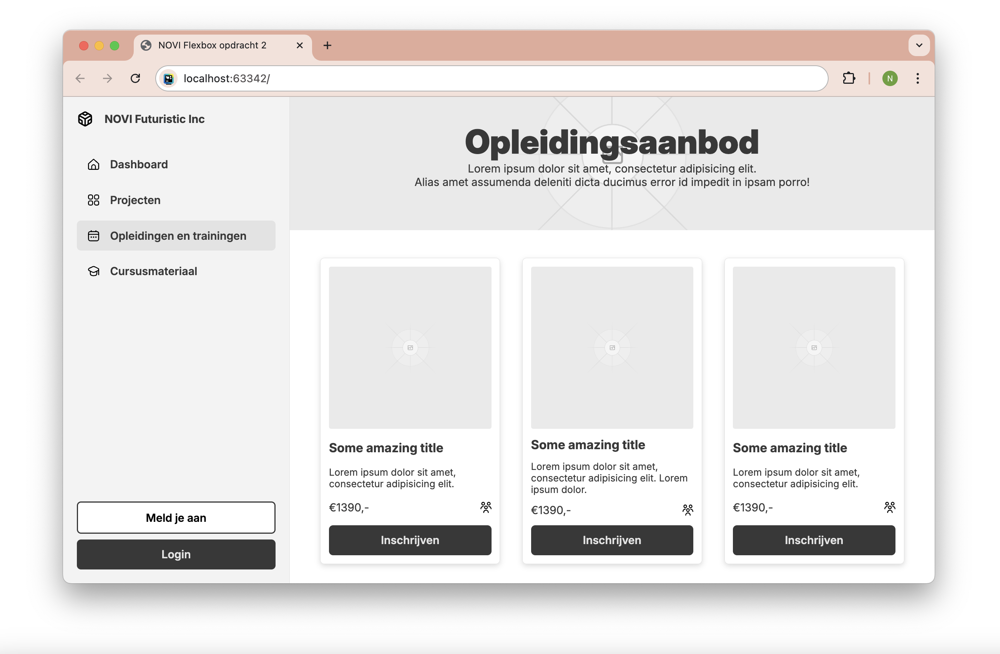
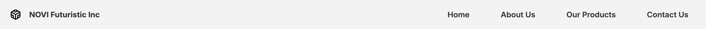
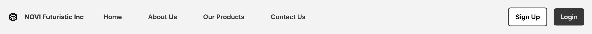
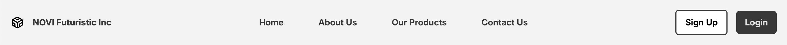
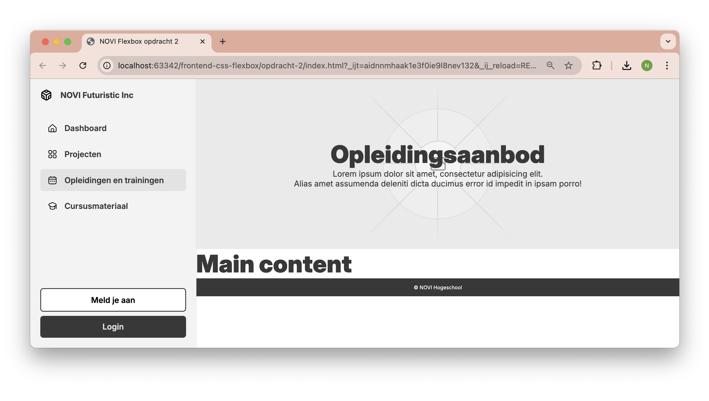
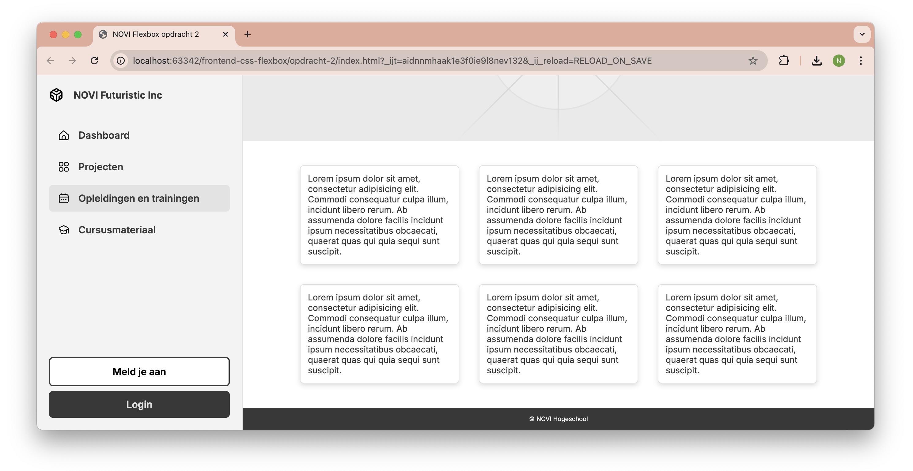
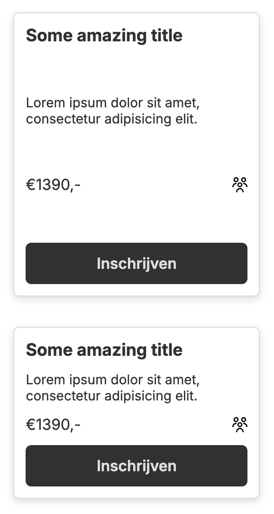

# Opdrachtbeschrijving

**Inhoudsopgave**

1. [Inleiding](#inleiding)
2. [Opdracht 1: Navigatie alignment](#opdracht-1-alignment)
3. [Opdracht 2: Pagina layout](#opdracht-2-layout)

## Inleiding

Flexbox is een krachtige tool waarmee je elementen flexibel kunt uitlijnen en complexe layouts kunt maken. Eigenlijk is
er bijna niets wat Flexbox _niet_ kan! In deze opdracht ga je aan de slag met flexbox om zowel menu's als een complete
paginalayout te bouwen.

In de eerste opdracht focus je op het positioneren van children (flex items) binnen een parent (flex container) in
verschillende navigatiemenu's. In de tweede opdracht ga je een uitgebreide layout bouwen met behulp van properties als
`flex-basis`, `flex-grow` en `flex-shrink`.

Om het je makkelijker te maken, is de HTML al voor je klaargezet. Jij hoeft alleen de CSS te schrijven. Wil je een
overzicht van alle flexbox properties? Bekijk
dan [dit handige overzicht](https://css-tricks.com/snippets/css/a-guide-to-flexbox/).

## Opdracht 1: Alignment

Zorg dat de menu-items in de navigatiebalk er precies zo uitzien als in de voorbeelden. De HTML-structuur staat al
klaar; jouw taak is om met flexbox de juiste uitlijning te realiseren in styles.css. Let op:

* Je mag geen bestanden verplaatsen.
* Je mag wel classes toevoegen aan de HTML-elementen wanneer je dit nodig hebt;
* Je mag `do-not-edit.css` niet aanpassen (hierin staat de basisopmaak, zoals kleuren en typografie).
* Gebruik **uitsluitend** Flexbox properties voor de uitlijning (dus geen `position`, `margin`of `padding`).

### Opdracht 1a

### Opdracht 1b

### Opdracht 1c

### Opdracht 1d

### Opdracht 1e

## Opdracht 2: Layout

Tijd om je flexbox-skills verder te ontwikkelen! In deze opdracht ga je een complete paginalayout maken, inclusief een
zijmenu, een header, een footer en een dynamische contentsectie. Geen zorgen: dit doen we stap voor stap. Uiteindelijk
moet jouw pagina er zo uitzien:

Ook hier gebruik je **uitsluitend** flexbox properties. `padding` mag je wél toepassen, maar `position` en `margin`
blijven verboden terrein.

### 2a: Globale pagina layout

* Verdeel jouw pagina in een zijmenu (links) en de hoofdcontent (rechts). _Tip:_ het tijdelijk kleuren van
  de randen helpt vaak om beter te zien wat er gebeurt.
* De pagina moet _altijd_ de volledige hoogte van het scherm innemen, zodat hij eruit ziet als een applicatie.*
* Zorg ervoor dat de content in het rechter gedeelte niet uit de container valt, door
  de [overflow property](https://developer.mozilla.org/en-US/docs/Web/CSS/overflow-y) te gebruiken. Je kunt testen of
  het
  werkt door een stuk tekst van ongeveer 500 woorden toe te voegen en te kijken of er een scollbar ontstaat.
* De menu-balk mag nooit kleiner worden dan 250 pixels. Zorg ervoor dat de content bij het aanpassen van de grootte van
  het browser-window _bijna alle_ ruimte opeist of weer inlevert, maar niet _alles_. Om dit goed te laten werken als er
  straks content in staat, zul je _zowel de rechter als de linkerkant_ van het scherm een `flex-basis` waarde moeten
  toewijzen.

*Zorg ervoor dat je elementen (op deze specifieke uitzondering na!) nooit een vaste `height` toewijst. Dit maakt de
pagina minder _responsive_, omdat tekst en andere content "eruit kan vallen" wanneer er te weinig ruimte is. Wanneer je
toch extra hoogte aan een element toe wil voegen, gebruik je in alle andere gevallen verticale `padding`.

### 2b: Verticale navigatie

Je hebt inmmiddels al wat ervaring met het stylen van horizontale menubalken, dus een verticale gaat je ook zeker
lukken! Zorg ervoor dat jouw menu er _precies zo uitziet_ als op het voorbeeld.

* _Onthoud:_ gebruik geen `position` of `margin` properties. Wil je toch ruimte tussen items creëren? Neem dan eens een
  kijkje bij de [gap property](https://developer.mozilla.org/en-US/docs/Web/CSS/gap) van Flexbox.
* Het logo en de links staan altijd bovenaan.
* De knoppen blijven altijd onderaan, ongeacht de schermhoogte.
* De iconen die je nodig hebt voor de menu-items, staan in de map `assets`. Zorg je ervoor dat ze altijd netjes
  uitlijnen
  met de tekst waar de naast staan?

_Tip:_ als je de css-class `active` toevoegt aan één van de links `<a>`, krijgt deze een permanent grijze
achtergrondkleur zoals op het voorbeeld.

### 2c: Header en footer

Vul de header met tekst zodat het er precies zo uitziet als het voorbeeld.

* Gebruik de placholder-afbeelding uit de `assets`-map als achtergrond-afbeelding.
* Je mag de footer zelf donkergrijs maken (`#383838`).

_Tip:_ het centreren van tekst hoef je bijna nooit op te lossen met Flexbox, daar hebben we `text-align` voor. Deze
property werkt trouwens ook op _alle inline-elementen_, zoals afbeeldingen, video's, buttons en invoervelden!

### 2d: Productkaartenoverzicht

Nu is het tijd om een dynamisch overzicht van productkaarten te maken. We beginnen eerst met de globale layout - in de
volgende opdracht vul je ze pas met de daadwerkelijke content.

* Creëer 6 productkaarten met ieder ongeveer 30 woorden. _Tip:_ als je het juiste element gebruikt, wordt
  de rand en schaduw automatisch toegepast.
* Elke kaart is maximaal 260 pixels breed.
* Zorg dat ze naast elkaar staan en bij gebrek aan ruimte naar een nieuwe regel verspringen.
* Iedere regel met kaarten moet altijd in het midden van de pagina worden uitgelijnd.

### 2e: Inhoud productkaarten

Nu je de productkaarten correct hebt uitgelijnd, gaan we ze verder opmaken en vullen met content.

* Vul nu één kaart met content zoals in het voorbeeld, maar sla de afbeelding nog even over.
* De elementen in de kaart moeten zich aanpassen aan de grootte van de content. Je kunt dit testen door één van de
  kaarten in een rij veel meer woorden te geven dan de andere. Kijk vervolgens hoe de andere kaarten reageren en pas
  indien nodig je flexbox-instellingen aan zodat alles mooi blijft uitgelijnd.
* Als je tevreden bent, kun je deze content voor alle kaarten
  gebruiken.

* Voeg een afbeelding toe aan alle kaarten en zorg dat deze _responsive_ zijn.

Als je alles goed hebt geïmplementeerd, zou jouw pagina er precies zo uit moeten zien als de voorbeelden. Test je
project door het scherm te verkleinen en te vergroten: past alles zich netjes aan?